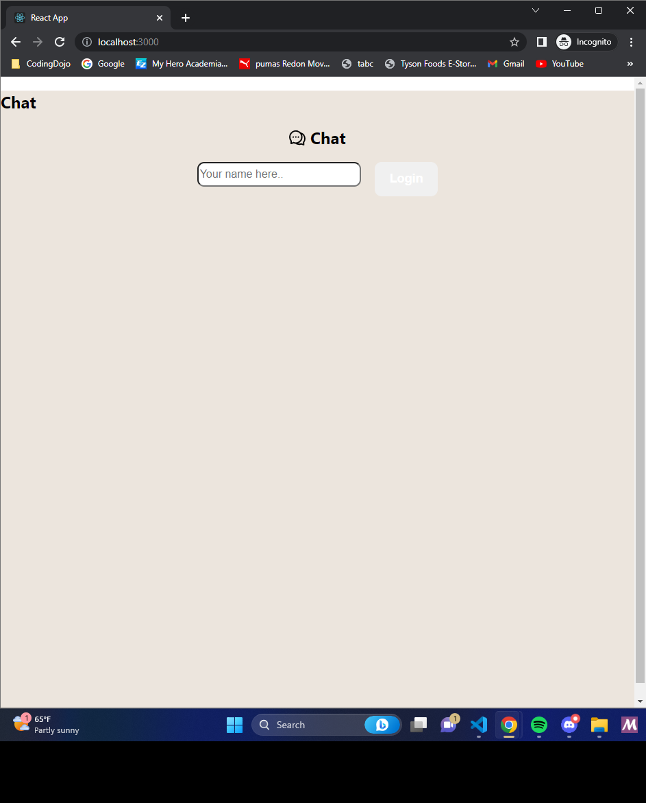

<h2>Hello World!,</h2>

# This is a chat based project with no true database.

<h4> What really inspired me to do this project, is the lack of customer service over the phone. </h4>

Initially this project was supposed to take on higher altitudes but it fell short due to it's trickiness.

I built a chat application for websites to have on their page, because there are times to where the client has some type of trouble shoot error or the client needs some step by step solution with their product.

Upon making this wireframe, I was overly ambitious into making this into reality.

It was suppose to have an AI in the beginning, and also a talk to text feature.

.png)

I like to start off by thanking my Mentor Heidi C. and Christian L. taking time to teach me these amazing skills, that I never had before, and also appreciating the help, and imparting new knowledge each and everyday while in this bootcamp.

This was originally taken from a youtuber Koding 101.
https://www.youtube.com/watch?v=LD7q0ZgvDs8

All the avatars are generated from https://www.picsum.photos

# <h3>I was intrigued about how the project came to be, but while working into the project, I came to several issues at hand, and had help with contributing into this project due to A LOT of bugs!</h3>
1. The logic was off - and the issue at hand was the login/logout feature, messages were saved from a previous conversation.
2. Spelling is a must - everything is about making sure spelling is correct down to the T.
3. The server kept running an infinite loop - we had to implement socket.broadcast.emit, in order to cease the inifinite loop of connecting.

# <h2>The technologies that I've used</h2>
1. socket.io - a bi-directional cross communication

2. antd - ant design is a UI library that can be used with data flow solutions and application frameworks in any React projects and ecosystem.

3. lodash - helps programmers write more concise and maintainable JavaScript.

# At the end of the day this is how the project looks!

<h2> This is the Login page

<h2> This is the chat page

